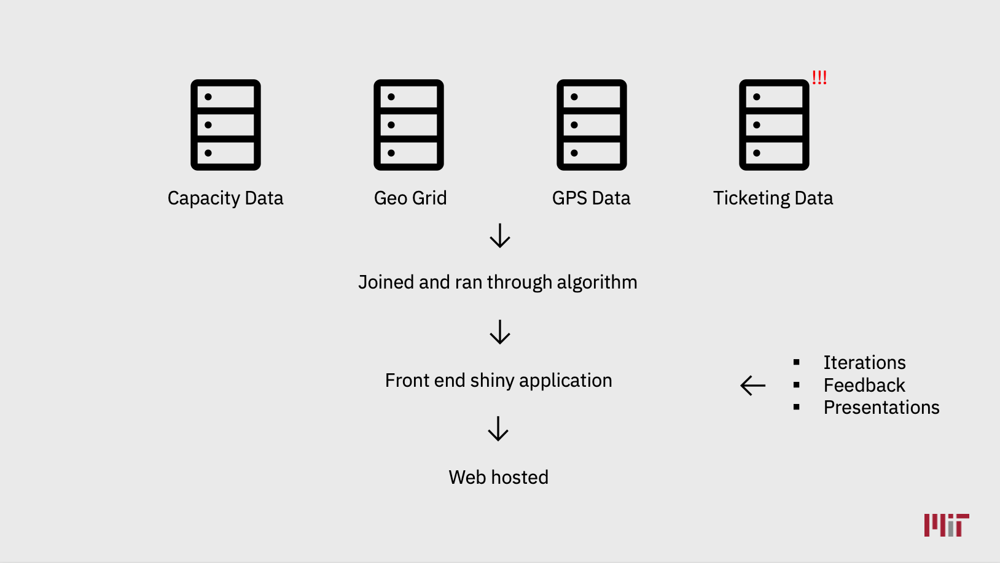
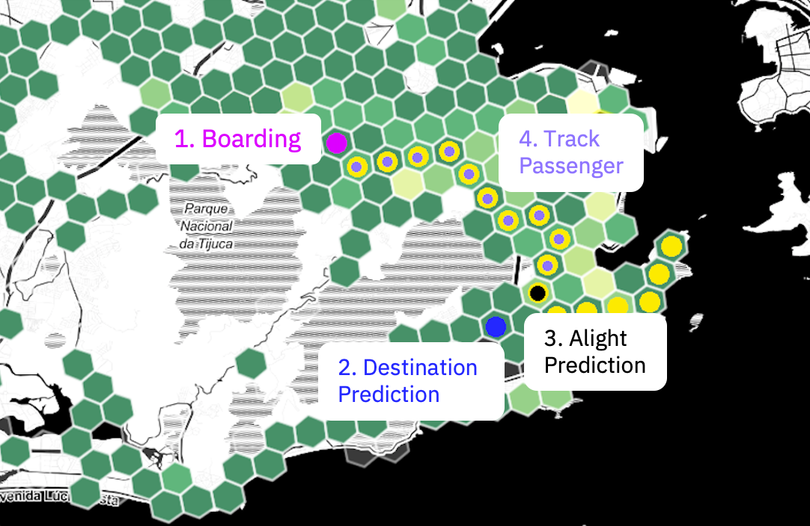

```{r setup, include=FALSE}
knitr::opts_chunk$set(echo = TRUE)
```

# Overview

During the Summer Semester of the DEDP Program I completed two internships. One at the Rio de Janeiro City Hall and another with the World Bank.

With the Department of Transport at the Rio de Janeiro City Hall (SMTR) I worked on the development of an application to analyse bus ticketing data. The goal was to help improve the allocation of buses throughout Rio's network.

At the World Bank I joined the Data and Evidence for Justice Reform (DE JURE) team of the Development Impact Evaluation (DIME) Unit. Within that team I worked on a project with the Kenyan Judiciary. The project aimed to test the impact of a technological innovation on the mediation process in Kenya. This involved the development of a web application and the running of a randomized control trial (RCT).

I dedicated approximately 40% of my time to the World Bank, with the remaining time was spent with the Rio de Janeiro City Hall.

# Rio de Janeiro City Hall

*Department of Transport*

{width="200"}

## Project

The department's objective was to build a website to monitor the utilization of the bus network. This would provide visibility of utilization at the bus, line, day and hourly level and provide a systematic way to analyse supply and demand mismatches. The website would be used to inform bus reallocation decisions such as whether to either add or subtract buses from a line at a particular time and/or day of the week and/or subsection of a line.

## Background

-   Rio de Janeiro is the 19th largest metropolitan area in the world.

-   Millions use its public transport network daily to commute.

-   It has the 3rd highest average commute time in the world at 67 minutes each way. Only Jakarta and Istanbul have longer average commute times.

-   SMTR manage Rio de Janeiro's massive bus fleet of over 5,000 vehicles and 600 routes.

-   Currently, the department has no visibility over the bus network fleet utilization.

(Duru, "Capstone Employers 2021.")

## Motivation

The project was motivated by the recent passage of legislation allowing the Agency to obtain RioCard data for the first time. RioCard is Rio de Janeiro's public transport smart-card ticketing system. The data is currently held by a private contractor.

With this data, along with their existing datasets, I worked with the key end users to create the application.

## Methodology

One key challenge with ticketing data is that a passenger taps on at the beginning of a trip but does not tap off at the end. This makes calculating the number of passengers on a bus at a particular time, and thus utilization, difficult.

As such, the project involved combining four datasets - capacity, geogrid, gps, and ticketing data - which were fed through an algorithm designed to predict the alighting location of every passenger and then track that passenger throughout their journey. The number of customers on any bus at a particular time can then be calculated to provide visibility on bus utilization.

A front end R shiny application was then created and hosted for the Agency to interact with the data across various slices (bus, day, hour, route) to analyse the output and inform bus reallocation decisions.

All this was then iterated over through constant communication and presentations with the Rio team.

{width="581"}

### Datasets {.tabset .tabset-fade .tabset-pills}

#### Overview

The datasets used throughout the project are described below:

+------------------------------------------+---------------------------------------------------------------------------------------------------------------------------------------------------------------------------------+
| Dataset                                  | Description                                                                                                                                                                     |
+==========================================+=================================================================================================================================================================================+
| [H3 cell](https://eng.uber.com/h3/) Data | This table mapped hexagons to the GPS coordinates of Rio de Janeiro. This allowed data to be aggregated to a H3 resolution of 9.                                                |
+------------------------------------------+---------------------------------------------------------------------------------------------------------------------------------------------------------------------------------+
| Capacity Data                            | These tables contained the number of seat and number of standing passengers a particular bus would allow.                                                                       |
+------------------------------------------+---------------------------------------------------------------------------------------------------------------------------------------------------------------------------------+
| GPS Data                                 | This table contains the GPS pings of all buses running at a given time on the network. The system would ping a bus once every minute and records its GPS coordinates.           |
+------------------------------------------+---------------------------------------------------------------------------------------------------------------------------------------------------------------------------------+
| Ticketing (RioCard) Data                 | This dataset was critical to the project. It contained a row for every time a passenger tapped onto a bus. Each tap could be matched to a particular bus, at a particular time. |
|                                          |                                                                                                                                                                                 |
|                                          | Importantly, a passenger does not tap off a bus when alighting. So part of the project was inferring a passengers destination.                                                  |
+------------------------------------------+---------------------------------------------------------------------------------------------------------------------------------------------------------------------------------+

#### H3 Cell Data

The figure below shows H3 cells of resolution 9 layered onto a map of Rio de Janeiro.


#### Capacity Data

The visualization below was created by matching GPS data with capacity and H3 data, then aggregating at both a H3 tile and 30 minutes interval level. It shows how capacity varies throughout the network over a particular day where the color and height of a tile both represent the total capacity of buses that have passed through that tile within a 30 minute interval. It is evident that capacity peaks twice throughout the day, with peaks being more dramatic in certain areas.


#### GPS Data

The following time-lapse was created by matching GPS data with capacity and H3 data. The visualization tracks a selection of buses on their journey throughout a particular day. The heights of the tiles represent their total capacity. As can be seen below, many different bus types are used throughout the network.


### Alighting Prediction

As mentioned previously, ticketing data only contains a passengers' onboarding tap but not their destination. This makes calculating the number of passengers on a bus at a particular time difficult.

To solve this problem, I created an algorithm to predict the passengers' alighting location. First a tap is matched to a particular bus at a particular time. I then predicted a destination based on the start of the passengers' next trip. Then, from this destination, I predicted where along the bus's route the passenger alighted from. To do this I took a 2 hour window (based on expert judgement) of bus movements from the tap on point and calculated the distance from each of the bus's location with the passengers predicted destination. The shortest distance (with the shortest journey time) was taken as the alighting location.

That passenger was then assumed to be on that bus between the boarding and predicted alighting locations. This process was then repeated for all passenger journeys.

{width="493"}

**Result**

The results of the above prediction model can be seen in the time-lapse below. It shows the predicted number of passengers on board the bus at a particular time. As can be seen, the model estimates appear reasonable. Towards the end of the route there are fewer passengers' with passenger numbers peaking during expected peak times.


> "It makes a lot of sense, i think it's pretty accurate"
>
> -Guilherme Alves, SMTR

### Technical Implementation

Given the size of the datasets involved, care was taken to ensure the application's performance. For example, the ticketing data contained more than 1.5 million taps per day and for a given day, the model calculated in excess of 200 million rows when predicting the alighting location.

As such, the following strategy was employed:

-   The algorithm and all substantial joins were done on the server side in SQL. The joins and calculations were implemented as SQL views.

-   Only the final aggregations and visualizations were done locally in R and R Shiny.

## Final Output

The final product culminated in the following website. I encourage the reader to explore the application at their leisure.

> [riotransport.shinyapps.io/prod/](https://riotransport.shinyapps.io/prod/)


## Caveats and Future Work

-   I was only able to obtain one day of ticketing data. In the future, the application should be replicated with more ticketing data.

-   The application could be combined with socioeconomic and geographical data such as income, poverty rates and retail establishments to both improve the model and inform the end user.

-   A model to smart suggest changes to the network. This could suggest the routes with the highest imbalance requiring attention first.

## Feedback from the Rio Team

This section contain feedback from Joao Carabetta (Head of Data Science).

***How it is going to be used***

*Even though we just managed to get 1 day worth of data, the project was useful in several aspects:*

-   *It is a real and practical case of the importance of having full access to smart card data. The outputs were used to make the case to push for a transition on how the city contracts the companies that manage this data.*

-   *The process of understanding and acquiring the data helped the team to think about on how to use this information. It showed us the data that is still missing to build a complete OD matrix such as vans gps and metro/train ticketing.*

-   *We also understood what is the real complexity of dealing with this dataset and what resources will be need in the future to use and scale it.*

-   *The planning team will be able to use the results to have a rough understanding of the transit patterns that were unexpected. It is just one day, but we had no days before.*

***Feedback***

-   *It was great to work with Ashley. The whole team wanted to hire him to keep developing tools for the city.*

-   *He understands hard concepts quickly and is able to discuss their consequences on the model.*

-   *He proactively comes with ideas and solutions on how to tackle difficult problems.*

-   *He can also work independently, solving the problems on his own and he brings back considerations and possible flaws of the solution.*

-   *I also felt that he wants to solve these problems because they have a positive impact on the population, which shows what he is driven by.*

# References

Duru, Maya. "Capstone Employers 2021." MIT J-PAL, 1 Mar. 2021.
